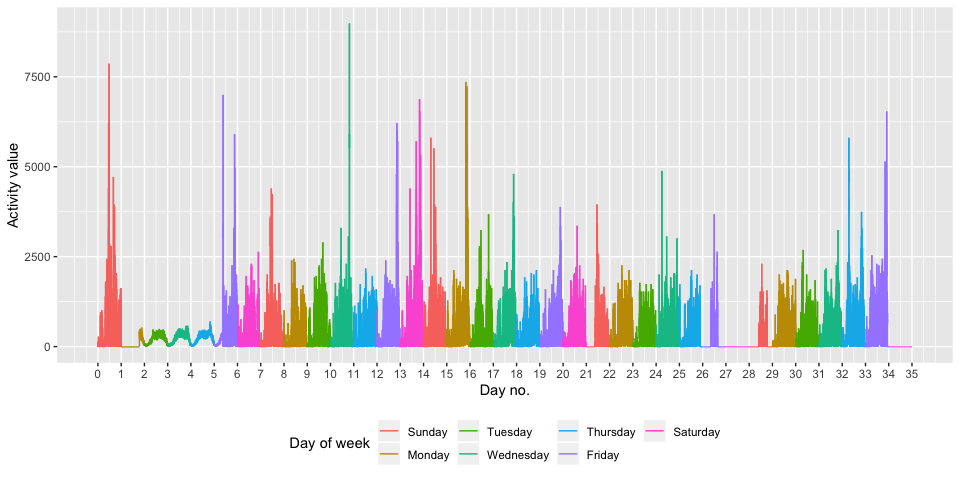

P8105 Homework 3
================
Junxian Chen (jc5314)
10/6/2019

# Problem 1

Load the libraries and data:

``` r
library(tidyverse)
library(p8105.datasets)
data("instacart")
```

### 1\. Description of the dataset:

  - **Size of the dataset**: The dataset contains 1384617 observations
    and 15 variables.

  - **Structure of the data**: The dataset records information of online
    grocery orders from the Instacart users. Each row represents one
    order of a product. Variables showing order information, product
    information, customer information, aisle information, information of
    purchasing time, etc., are included in the dataset.

  - **Key variables**:

<!-- end list -->

1)  The mean of the values in variable `reordered` is 0.5985944, which
    means that nearly 60% products were reordered.

2)  In variable `order_dow` which menas the day of week the order was
    placed, the value ‘0’ appeares the most. This means that most
    products were ordered on Sunday.

3)  In variable `order_hour_of_day` which menas the hour of day the
    order was placed, the value ‘14’ appeares the most. This means that
    most products were ordered at 2 pm.

4)  In variable `days_since_prior_order`, the mean value is 17.0661259,
    which means that people would order again after 17 days on average.

5)  For variable `aisle`, there are 134 aisles in total, and the aisles
    that the most items ordered from is ‘fresh vegetables’.

<!-- end list -->

  - **Illstrative example of observations**:

Below is the first row of observations in the dataset. It represents an
order of a product from one customer. In this example, the data tell us
a customer brought a Bulgarian Yogurt from the ‘yogurt’ aisle at 10 am
on Thursday. This was a re-order from this customer and it has been 9
days since his/her last
order.

| order\_id | product\_id | add\_to\_cart\_order | reordered | user\_id | eval\_set | order\_number | order\_dow | order\_hour\_of\_day | days\_since\_prior\_order | product\_name    | aisle\_id | department\_id | aisle  | department |
| --------: | ----------: | -------------------: | --------: | -------: | :-------- | ------------: | ---------: | -------------------: | ------------------------: | :--------------- | --------: | -------------: | :----- | :--------- |
|         1 |       49302 |                    1 |         1 |   112108 | train     |             4 |          4 |                   10 |                         9 | Bulgarian Yogurt |       120 |             16 | yogurt | dairy eggs |

### 2\. Answers to the questions:

  - There are 134 aisles in total, and the aisles that the most items
    ordered from is ‘fresh vegetables’. *Comment*: It shows that those
    customers had large demands in fresh vegetables and they may had
    health lifestyles.

  - A plot that shows the number of items ordered in each aisle,
    limiting to aisles with more than 10000 items ordered：

<!-- end list -->

``` r
aisle_plot = 
  instacart %>% 
  count(aisle, name = 'number_of_items_ordered') %>%
  filter(number_of_items_ordered > 10000) %>%
  ggplot(aes(reorder(aisle, number_of_items_ordered), x = number_of_items_ordered)) + 
    geom_point() +
    xlab('Number of each item ordered') +
    ylab('Aisle name') +
    labs(title = 'Number of items ordered in each aisle with more than 10000 items ordered')
  
# show the plot

aisle_plot
```

<!-- -->

*Comment*: The aisles that sell fresh vegetables, fresh fruits, and
packaged vegetables fruits had the top three number of itmes ordered.
Most of the remained aisles had less than 40,000 items orderd.

  - A table showing the three most popular items in each of the aisles
    `baking ingredients`, `dog food care`, and `packaged vegetables
    fruits` (numbers of times each item is ordered are also included):

<!-- end list -->

``` r
pop_item = 
  instacart %>% 
  filter(
    aisle %in% c('baking ingredients', 'dog food care', 'packaged vegetables fruits')
  ) %>% 
  group_by(aisle) %>% 
  count(product_name, name = 'number_of_ordered_time') %>% 
  top_n(n = 3, wt = number_of_ordered_time) %>% 
  knitr::kable(col.names = c('Aisle name', 'Top 3 popular items on this aisle', 'Number of ordered time'),
               caption = 'Table 1: The 3 most popular items in the given aisles and their numbers of time being ordered.')

# show the table

pop_item
```

| Aisle name                 | Top 3 popular items on this aisle             | Number of ordered time |
| :------------------------- | :-------------------------------------------- | ---------------------: |
| baking ingredients         | Cane Sugar                                    |                    336 |
| baking ingredients         | Light Brown Sugar                             |                    499 |
| baking ingredients         | Pure Baking Soda                              |                    387 |
| dog food care              | Organix Chicken & Brown Rice Recipe           |                     28 |
| dog food care              | Small Dog Biscuits                            |                     26 |
| dog food care              | Snack Sticks Chicken & Rice Recipe Dog Treats |                     30 |
| packaged vegetables fruits | Organic Baby Spinach                          |                   9784 |
| packaged vegetables fruits | Organic Blueberries                           |                   4966 |
| packaged vegetables fruits | Organic Raspberries                           |                   5546 |

Table 1: The 3 most popular items in the given aisles and their numbers
of time being ordered.

*Comment*: The top three most ordered ingredients for baking were cane
sugar, light brown sugar, and pure baking soda. People love buying
organic food, even for their dog.

  - A table showing the mean hour of the day at which Pink Lady Apples
    and Coffee Ice Cream are ordered on each day of the week:

<!-- end list -->

``` r
table_p1 = 
  instacart %>% 
    filter(
    product_name %in% c('Pink Lady Apples', 'Coffee Ice Cream')
  ) %>% 
  group_by(product_name, order_dow) %>% 
  mutate(mean_hour = mean(order_hour_of_day)) %>% 
  select(product_name, order_dow, mean_hour) %>% 
  arrange(order_dow) %>% 
  pivot_wider(
    names_from = order_dow,
    values_from = mean_hour,
    values_fn = list(mean_hour = mean)
  ) %>% 
  knitr::kable(col.names = c('Product Name', 'Sunday', 'Monday', 'Tuesday', 'Wednesday', 'Thursday', 'Friday', 'Saturday'),
               caption = 'Table 2: Mean hour of the day at which the product was ordered on each day of the week.') 

# show the table

table_p1
```

| Product Name     |   Sunday |   Monday |  Tuesday | Wednesday | Thursday |   Friday | Saturday |
| :--------------- | -------: | -------: | -------: | --------: | -------: | -------: | -------: |
| Pink Lady Apples | 13.44118 | 11.36000 | 11.70213 |  14.25000 | 11.55172 | 12.78431 | 11.93750 |
| Coffee Ice Cream | 13.77419 | 14.31579 | 15.38095 |  15.31818 | 15.21739 | 12.26316 | 13.83333 |

Table 2: Mean hour of the day at which the product was ordered on each
day of the week.

*Comment*: Both of the Pink Lady Apples and Coffee Ice Cream were
ordered in the noon around 11 a.m. ~ 3 p.m. on average on each day of
week.

# Problem 2

Load the data:

``` r
data("brfss_smart2010")
```

### 1\. Clean the data:

``` r
brfss_dat = 
  brfss_smart2010 %>% 
  janitor::clean_names() %>% 
  rename(state = locationabbr, location = locationdesc) %>% 
  filter(
    topic == 'Overall Health',
    response %in% c('Poor', 'Fair', 'Good', 'Very good', 'Excellent')) %>% 
  mutate(
    response = factor(response, levels = c('Poor', 'Fair', 'Good', 'Very good', 'Excellent'))
  )
```

### 2\. Answers to the questions:

For 2002:

``` r
brfss_dat %>% 
  filter(year == '2002') %>% 
  group_by(state, location) %>% 
  summarize() %>% 
  summarize(number_of_location_observed = n()) %>% 
  filter(number_of_location_observed >= 7)
```

    ## # A tibble: 6 x 2
    ##   state number_of_location_observed
    ##   <chr>                       <int>
    ## 1 CT                              7
    ## 2 FL                              7
    ## 3 MA                              8
    ## 4 NC                              7
    ## 5 NJ                              8
    ## 6 PA                             10

  - Based on the above results, in 2002 the states that were observed at
    7 or more locations were: CT, FL, MA, NC, NJ, and PA.

For 2010:

``` r
brfss_dat %>% 
  filter(year == '2010') %>% 
  group_by(state, location) %>% 
  summarize() %>% 
  summarize(number_of_location_observed = n()) %>% 
  filter(number_of_location_observed >= 7)
```

    ## # A tibble: 14 x 2
    ##    state number_of_location_observed
    ##    <chr>                       <int>
    ##  1 CA                             12
    ##  2 CO                              7
    ##  3 FL                             41
    ##  4 MA                              9
    ##  5 MD                             12
    ##  6 NC                             12
    ##  7 NE                             10
    ##  8 NJ                             19
    ##  9 NY                              9
    ## 10 OH                              8
    ## 11 PA                              7
    ## 12 SC                              7
    ## 13 TX                             16
    ## 14 WA                             10

  - Based on the above esults, in 2010 the states that were observed at
    7 or more locations were: CA, CO, FL, MA, MD, NC, NE, NJ, NY, OH,
    PA, SC, TX, and WA.

*Comment*: Much more locations in different states in US were included
in the observation in 2010 than in 2002, and Florida had the most
observed locations (up to 41) in 2010.

``` r
excellent_dat =   
  brfss_dat %>% 
  filter(response == 'Excellent') %>% 
  group_by(year, state) %>% 
  mutate(data_value_mean = mean(data_value, na.rm = TRUE)) %>% 
  select(year, state, data_value_mean) %>% 
  distinct()
```

``` r
spaghetti_plot = 
  excellent_dat %>% 
  ggplot(aes(x = year, y = data_value_mean, color = state)) +
  geom_line() +
  xlab('Year') + 
  ylab('Mean data value')

# show the plot

spaghetti_plot
```

<!-- -->

*Comment:* The vaerage values of recorded data of those states were
quite fluctuant during 2002 to 2010, and the overall trend was
decreasing.

``` r
data_value_plot = 
  brfss_dat %>% 
  filter(
    year %in% c(2006, 2010),
    state == 'NY') %>% 
  ggplot(aes(x = response, y = data_value)) +
  geom_point() +
  xlab('Response') +
  ylab('Data value') +
  facet_grid(~year)

# show the plot
  
data_value_plot
```

<!-- -->

*Comment:* The distribution of points in the plot of 2006 is similar to
that in 2010: the ‘Good’ and ‘Very good’ responses had relatively higher
data values and the ‘poor’ response had relatively lower data values.

# Problem 3

### 1\. Load and tidy the dataset:

``` r
acc_dat = 
  read_csv("./data/accel_data.csv") %>% 
  janitor::clean_names() %>% 
  mutate(
    weekday_weekend = case_when(
      day %in% c('Monday', 'Tuesday', 'Wednesday', 'Thursday', 'Friday') ~ 'Weekday',
      day %in% c('Saturday', 'Sunday') ~ 'Weekend',
    ),
    day = factor(day, levels = c('Sunday', 'Monday', 'Tuesday', 'Wednesday', 'Thursday', 'Friday', 'Saturday')),
    week = as.integer(week),
    day_id = as.integer(day_id)
  ) %>% 
  pivot_longer(
    activity_1:activity_1440, 
    names_to = "act_id", 
    values_to = "act_value"
  )

str(acc_dat)
```

    ## Classes 'tbl_df', 'tbl' and 'data.frame':    50400 obs. of  6 variables:
    ##  $ week           : int  1 1 1 1 1 1 1 1 1 1 ...
    ##  $ day_id         : int  1 1 1 1 1 1 1 1 1 1 ...
    ##  $ day            : Factor w/ 7 levels "Sunday","Monday",..: 6 6 6 6 6 6 6 6 6 6 ...
    ##  $ weekday_weekend: chr  "Weekday" "Weekday" "Weekday" "Weekday" ...
    ##  $ act_id         : chr  "activity_1" "activity_2" "activity_3" "activity_4" ...
    ##  $ act_value      : num  88.4 82.2 64.4 70 75 ...

Description of the dataset:

After tidying and wrangling the raw data, the resulting dataset now
contains 6 variables: `week` is the the week number, `day_id` is the ID
represents the order in which the days appear in the datase, `day`
represnts the day of week, `weekday_weekend` indicates whether this day
is a weekday or weekend, `act_id` is the ID for each activity record in
each minute, `act_value` is the value of the activity recorded in each
minute. There are total 50400 observations in this dataset which equals
to 1440 mins x 5 weeks x 7 days.

``` r
total_day_activity =
  acc_dat  %>% 
  group_by(week, day) %>% 
  summarize(sum_act = sum(act_value)) %>%
  knitr::kable(
    col.names = c('Week', 'Day of week', 'Total value of daily activity')
  )

# show the table

total_day_activity
```

| Week | Day of week | Total value of daily activity |
| ---: | :---------- | ----------------------------: |
|    1 | Sunday      |                     631105.00 |
|    1 | Monday      |                      78828.07 |
|    1 | Tuesday     |                     307094.24 |
|    1 | Wednesday   |                     340115.01 |
|    1 | Thursday    |                     355923.64 |
|    1 | Friday      |                     480542.62 |
|    1 | Saturday    |                     376254.00 |
|    2 | Sunday      |                     422018.00 |
|    2 | Monday      |                     295431.00 |
|    2 | Tuesday     |                     423245.00 |
|    2 | Wednesday   |                     440962.00 |
|    2 | Thursday    |                     474048.00 |
|    2 | Friday      |                     568839.00 |
|    2 | Saturday    |                     607175.00 |
|    3 | Sunday      |                     467052.00 |
|    3 | Monday      |                     685910.00 |
|    3 | Tuesday     |                     381507.00 |
|    3 | Wednesday   |                     468869.00 |
|    3 | Thursday    |                     371230.00 |
|    3 | Friday      |                     467420.00 |
|    3 | Saturday    |                     382928.00 |
|    4 | Sunday      |                     260617.00 |
|    4 | Monday      |                     409450.00 |
|    4 | Tuesday     |                     319568.00 |
|    4 | Wednesday   |                     434460.00 |
|    4 | Thursday    |                     340291.00 |
|    4 | Friday      |                     154049.00 |
|    4 | Saturday    |                       1440.00 |
|    5 | Sunday      |                     138421.00 |
|    5 | Monday      |                     389080.00 |
|    5 | Tuesday     |                     367824.00 |
|    5 | Wednesday   |                     445366.00 |
|    5 | Thursday    |                     549658.00 |
|    5 | Friday      |                     620860.00 |
|    5 | Saturday    |                       1440.00 |

*Comment:*

``` r
activity_plot = 
  acc_dat %>%
  group_by(week) %>% 
  arrange(week, day) %>%                   # arrange the whole data by the ordering of 'week' and 'day of week'
  ungroup() %>% 
  mutate(
   minute_id = seq.int(nrow(acc_dat))      # assign an ordered ID for each observation after ordering
  ) %>% 
  ggplot(aes(x = minute_id, y = act_value, group = week)) +   # create a plot for each minute vs. activity value (ordered by timeline)
  geom_line(aes(color = day)) +            
  scale_x_continuous(
    breaks = seq(0, 50400, by = 1440),
    labels = seq(0, 35)) +
  xlab('Day no.') +
  ylab('Activity value') +
  scale_color_hue(name = "Day of week") +
  theme(legend.position = "bottom")

# show the plot

activity_plot
```

<!-- -->

*Comment:*
