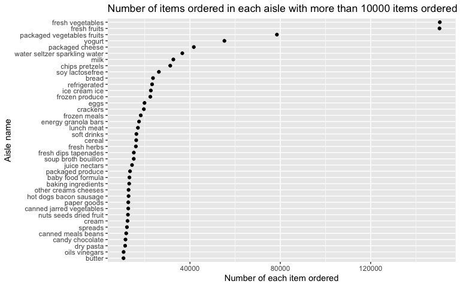

P8105 Homework 3
================
Junxian Chen (jc5314)
10/6/2019

# Problem 1

Load the libraries and data:

``` r
library(tidyverse)
library(p8105.datasets)
data("instacart")
```

**“write a short description of the dataset, noting the size and
structure of the data, describing some key variables, and giving
illstrative examples of observations.”**

The dataset contains 1384617 observations and 15 variables.

  - There are 134 aisles in total here, and the aisles that the most
    items ordered from is ‘fresh vegetables’.

  - A plot that shows the number of items ordered in each aisle,
    limiting to aisles with more than 10000 items ordered：

<!-- end list -->

``` r
aisle_plot = 
  instacart %>% 
  count(aisle, name = 'number_of_items_ordered') %>%
  filter(number_of_items_ordered > 10000) %>%
  ggplot(aes(reorder(aisle, number_of_items_ordered), x = number_of_items_ordered)) + 
    geom_point() +
    xlab('Number of items ordered') +
    ylab('Aisle name') +
    labs(title = 'Number of items ordered in each aisle with more than 10000 items ordered')
  
# show the plot

aisle_plot
```

<!-- -->

  - A table showing the three most popular items in each of the aisles
    `baking ingredients`, `dog food care`, and `packaged vegetables
    fruits` (numbers of times each item is ordered are also included):

<!-- end list -->

``` r
pop_item = 
  instacart %>% 
  filter(
    aisle %in% c('baking ingredients', 'dog food care', 'packaged vegetables fruits')
  ) %>% 
  group_by(aisle) %>% 
  count(product_name, name = 'number_of_ordered_time') %>% 
  top_n(n = 5, wt = number_of_ordered_time) %>% 
  knitr::kable(col.names = c('Aisle name', 'Top 5 popular items on this aisle', 'Number of ordered time'),
               caption = 'Table 1: The 3 most popular items in the aisles and their numbers of time being ordered.')

# show the table

pop_item
```

| Aisle name                 | Top 5 popular items on this aisle               | Number of ordered time |
| :------------------------- | :---------------------------------------------- | ---------------------: |
| baking ingredients         | Cane Sugar                                      |                    336 |
| baking ingredients         | Light Brown Sugar                               |                    499 |
| baking ingredients         | Organic Vanilla Extract                         |                    327 |
| baking ingredients         | Premium Pure Cane Granulated Sugar              |                    329 |
| baking ingredients         | Pure Baking Soda                                |                    387 |
| dog food care              | Organix Chicken & Brown Rice Recipe             |                     28 |
| dog food care              | Organix Grain Free Chicken & Vegetable Dog Food |                     24 |
| dog food care              | Small Dog Biscuits                              |                     26 |
| dog food care              | Snack Sticks Chicken & Rice Recipe Dog Treats   |                     30 |
| dog food care              | Standard Size Pet Waste bags                    |                     25 |
| packaged vegetables fruits | Organic Baby Spinach                            |                   9784 |
| packaged vegetables fruits | Organic Blueberries                             |                   4966 |
| packaged vegetables fruits | Organic Grape Tomatoes                          |                   3823 |
| packaged vegetables fruits | Organic Raspberries                             |                   5546 |
| packaged vegetables fruits | Seedless Red Grapes                             |                   4059 |

Table 1: The 3 most popular items in the aisles and their numbers of
time being ordered.

  - A table showing the mean hour of the day at which Pink Lady Apples
    and Coffee Ice Cream are ordered on each day of the week:

<!-- end list -->

``` r
table_p1 = 
  instacart %>% 
    filter(
    product_name %in% c('Pink Lady Apples', 'Coffee Ice Cream')
  ) %>% 
  group_by(order_dow) %>% 
  mutate(mean_hour = mean(order_hour_of_day)) %>% 
  select(product_name, order_dow, mean_hour) %>% 
  arrange(order_dow) %>% 
  pivot_wider(
    names_from = order_dow,
    values_from = mean_hour,
    values_fn = list(mean_hour = mean)
  ) %>% 
  knitr::kable(col.names = c('Product Name', 'Sunday', 'Monday', 'Tuesday', 'Wednesday', 'Thursday', 'Friday', 'Saturday'),
               caption = 'Table 2: Mean hour of the day at which the product was ordered on each day of the week.') 

# show the table

table_p1
```

| Product Name     | Sunday |   Monday |  Tuesday | Wednesday | Thursday |   Friday | Saturday |
| :--------------- | -----: | -------: | -------: | --------: | -------: | -------: | -------: |
| Pink Lady Apples |   13.6 | 12.17391 | 12.83824 |  14.68519 | 13.17308 | 12.64286 |    13.25 |
| Coffee Ice Cream |   13.6 | 12.17391 | 12.83824 |  14.68519 | 13.17308 | 12.64286 |    13.25 |

Table 2: Mean hour of the day at which the product was ordered on each
day of the week.

# Problem 2

``` r
data("brfss_smart2010")
```

Clean the data:

``` r
brfss_dat = 
  brfss_smart2010 %>% 
  janitor::clean_names() %>% 
  rename(state = locationabbr, location = locationdesc) %>% 
  filter(
    topic == 'Overall Health',
    response %in% c('Poor', 'Fair', 'Good', 'Very good', 'Excellent')) %>% 
  mutate(
    response = factor(response, levels = c('Poor', 'Fair', 'Good', 'Very good', 'Excellent'))
  )
```

  - In 2002, which states were observed at 7 or more locations? What
    about in 2010?

For 2002:

``` r
brfss_dat %>% 
  filter(year == '2002') %>% 
  group_by(state, location) %>% 
  summarize() %>% 
  summarize(number_of_locations = n()) %>% 
  filter(number_of_locations >= 7)
```

    ## # A tibble: 6 x 2
    ##   state number_of_locations
    ##   <chr>               <int>
    ## 1 CT                      7
    ## 2 FL                      7
    ## 3 MA                      8
    ## 4 NC                      7
    ## 5 NJ                      8
    ## 6 PA                     10

Therefore, based on the results, in 2002 the states that were observed
at 7 or more locations were: CT, FL, MA, NC, NJ, and PA.

For 2010:

``` r
brfss_dat %>% 
  filter(year == '2010') %>% 
  group_by(state, location) %>% 
  summarize() %>% 
  summarize(number_of_locations = n()) %>% 
  filter(number_of_locations >= 7)
```

    ## # A tibble: 14 x 2
    ##    state number_of_locations
    ##    <chr>               <int>
    ##  1 CA                     12
    ##  2 CO                      7
    ##  3 FL                     41
    ##  4 MA                      9
    ##  5 MD                     12
    ##  6 NC                     12
    ##  7 NE                     10
    ##  8 NJ                     19
    ##  9 NY                      9
    ## 10 OH                      8
    ## 11 PA                      7
    ## 12 SC                      7
    ## 13 TX                     16
    ## 14 WA                     10

Therefore, based on the results, in 2002 the states that were observed
at 7 or more locations were: CA, CO, FL, MA, MD, NC, NE, NJ, NY, OH, PA,
SC, TX, and WA.

``` r
excellent_dat =   
  brfss_dat %>% 
  filter(response == 'Excellent') %>% 
  group_by(year, state) %>% 
  mutate(data_value_mean = mean(data_value, na.rm = TRUE)) %>% 
  select(year, state, data_value_mean) %>% 
  distinct()
```

``` r
spaghetti_plot = 
  excellent_dat %>% 
  ggplot(aes(x = year, y = data_value_mean, color = state)) +
  geom_line() +
  xlab('Year') + 
  ylab('Mean data value')

spaghetti_plot
```

<!-- -->

``` r
data_value_plot = 
  brfss_dat %>% 
  filter(year %in% c(2006, 2010))
```
